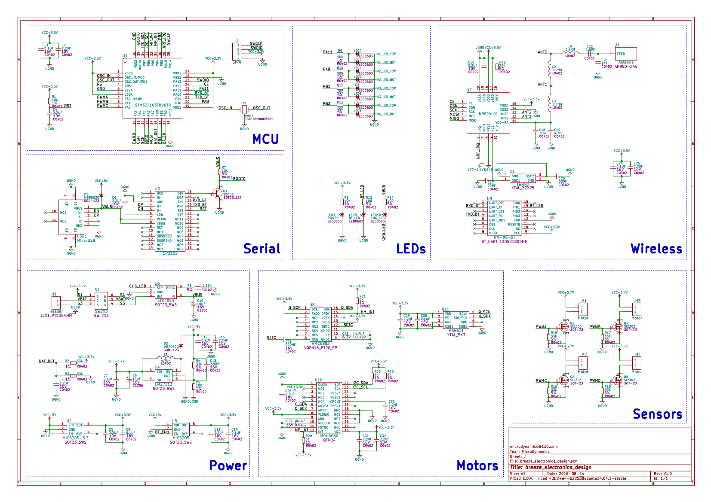

# breeze_electronics_design

## Description
This project is created and managed by KiCad software(http://kicad-pcb.org), which contains the breeze quadcopter's component library, footprint library, schematic, printed circuit boards, etc.

## Schematic

